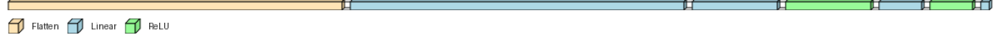

# Chinese Digit Recognition
---
## Version 1.0
This is just a practice for learning pytorch. It is something I did to practice after finishing the official Pytorch tutorial. So, it's easy and very similar with the example *FashionMNIST* given by the official Pytorch tutorial. Here is my simple network.

```
class RecognitionNetwork(nn.Module):
    def __init__(self):
        super().__init__()
        self.flatten = nn.Flatten()
        self.linear_relu_stack = nn.Sequential(
            nn.Linear(3*64 * 64, 4096),
            nn.Linear(4096, 1024),
            nn.ReLU(),
            nn.Linear(1024, 512),
            nn.ReLU(),
            nn.Linear(512, 15),
        )

    def forward(self, x):
        x = self.flatten(x)
        logits = self.linear_relu_stack(x)
        return logits

```
###### After 100 epochs we will reach about 70%
```
Epoch 99 
 -------------------------
loss: 0.660015 [   64/11999]
loss: 1.192717 [ 1344/11999]
loss: 0.761487 [ 2624/11999]
loss: 0.700470 [ 3904/11999]
loss: 0.984401 [ 5184/11999]
loss: 0.743671 [ 6464/11999]
loss: 0.635524 [ 7744/11999]
loss: 0.798912 [ 9024/11999]
loss: 1.092515 [10304/11999]
loss: 0.814506 [11584/11999]
Test Error: 
 Accuracy: 70.8%, Avg loss: 0.873255 

Epoch 100 
 -------------------------
loss: 0.750734 [   64/11999]
loss: 0.515754 [ 1344/11999]
loss: 0.836834 [ 2624/11999]
loss: 0.661097 [ 3904/11999]
loss: 0.719125 [ 5184/11999]
loss: 0.758513 [ 6464/11999]
loss: 0.656716 [ 7744/11999]
loss: 0.598785 [ 9024/11999]
loss: 0.849562 [10304/11999]
loss: 0.735557 [11584/11999]
Test Error: 
 Accuracy: 70.8%, Avg loss: 0.881129 

Done!
```
---
## The Dataset
https://www.kaggle.com/datasets/gpreda/chinese-mnist


---
## Run
```
git clone https://github.com/EMEEEEMMMM/ChineseDigitRecognition.git
```
Change the path in `main.py` and `DataAdjustment.py`

<small>main.py</small>
```
csv_file = (
    "/Change/it/to/your/path/ChineseDigitRecognition/data/chinese_mnist.csv"
)
project_dir = "/Change/it/to/your/path/ChineseDigitRecognition"
```
<small>DataAdjustment.py</small>
```
project_root_dir = "/Change/it/to/your/path/ChineseDigitRecognition/"
```
Download the dataset from kaggle with the [link](https://www.kaggle.com/datasets/gpreda/chinese-mnist) put the images in *data/data*

Run the `DataAdjustment.py`

And then just run `main.py`

---


